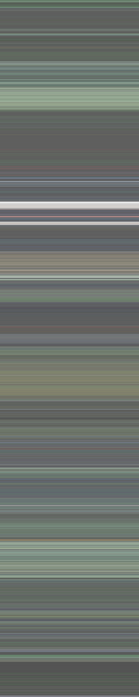

# moviecolors
Analyze the color palette of a movie

## Description
Inspired by a Reddit post and this website: https://thecolorsofmotion.com/, the
goal of this code is to perform color analysis on movies. A movies color
palette can tell a lot about the tone of a movie. Compare bright and
high-contrast colors of Disney animated films to the muted, brown tones of a
desert war film or the terminal black and green of The Matrix

